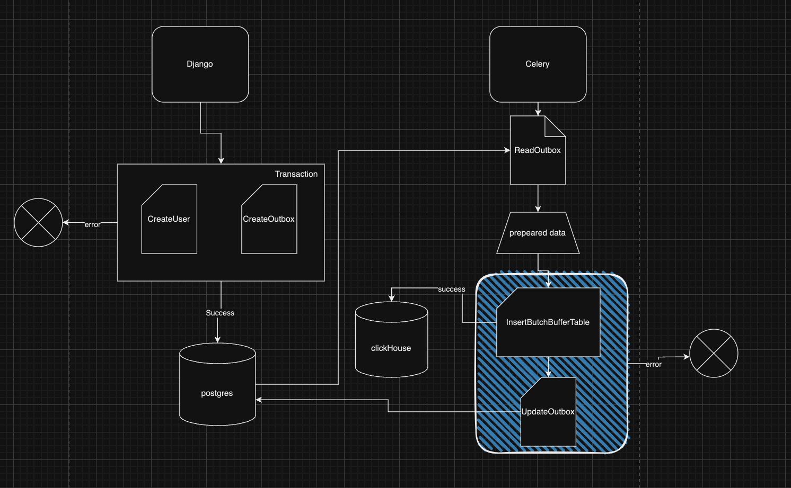

# Руководство по настройке проекта и архитектуре

## Содержание
1. [Техническое решение](#техническое-решение)
2. [Настройка проекта](#настройка-проекта)
3. [Диаграмма архитектуры](#диаграмма-архитектуры)

## Техническое решение
  
  Создана таблица `Outbox`. Сохранение события происходит в транзакции. Это позволяет откатывать изменения, если произойдет сбой на этапе сохранения в БД.

  Далее в отдельной асинхронной задаче (Celery) запускается процесс, который вычитывает `CHUNK_SIZE` несохраненных записей из таблицы `Outbox` (`processed_at IS NULL`).

  Происходит сохранение в ClickHouse пачками по `CHUNK_SIZE` в буферную таблицу. Это позволяет снизить нагрузку на запись в БД.

  Обновленные данные получают дату в поле `processed_at`.


## Настройка проекта

  Настройка и запуск проекта осталась такой же

1**Настройка переменных окружения:**
   Создайте файл `.env` в корне проекта с необходимыми переменными окружения.  

  Добавилась новая переменная в env CHUNK_SIZE - количество записей для отправки в clickHouse
   ```env
   CHUNK_SIZE=100
   ```


## Диаграмма архитектуры



Этот подход обеспечивает плавный, эффективный и неблокирующий поток данных, используя возможности асинхронных задач и пакетной обработки.

